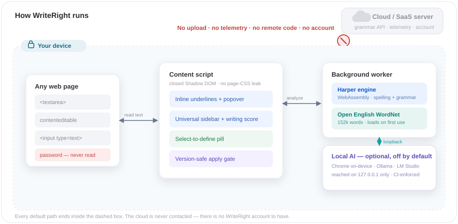

<div align="center">


### A privacy-first writing assistant for your browser

**Catches mistakes, explains them clearly, and helps you rewrite — entirely on your device.**
No account. No subscription. No telemetry. No paid AI.

[](https://github.com/iamadarsha/WriteRight/actions/workflows/ci.yml)
[](LICENSE)




</div>

WriteRight is a local, open-source alternative to Grammarly and QuillBot. Spelling,
grammar, readability, tone and a transparent writing‑health score all run in the
extension itself — there is no WriteRight server, and the default code path has
nowhere to send your text. Optional AI rewriting uses **your** local model (Chrome's
on‑device Gemini Nano, or an Ollama / LM Studio server you run) and nothing else.

- **Private by architecture, not by promise** — analysis never touches the network.
- **Works fully offline** — the language engine and a 152k‑word dictionary ship inside the extension.
- **Free, forever** — no tier, no upsell, no "premium" checks held back.
- **Honest about limits** — an editor it can't read cleanly is marked *unsupported*, not faked.

Click an underline (or press <kbd>Ctrl/Cmd</kbd>+<kbd>.</kbd>) for the category, a
plain‑language explanation, and one‑click replacements. Every fix goes through a
real `input` event, so the page's own undo still works — and it applies only while
the original text still matches exactly.

---

## See it work

### Rewrite a dense sentence

<div align="center"></div>

Over‑long or multi‑clause sentences get a blue **Clarity** underline. *Rephrase*
tightens just that sentence — with your local AI when it's available, or a safe
deterministic tidy‑up when it isn't.

### Shift the tone

<div align="center"></div>

An uncertainty‑aware tone estimate across nine tones, plus one‑tap mode pills —
*shorter, formal, casual, friendlier, more confident, more persuasive, simplify* —
that rewrite only the text you select.

---

## Everything it checks

| Local — always on, always offline | Optional local AI — off by default |
|---|---|
| Spelling & grammar ([Harper](https://github.com/Automattic/harper), WebAssembly) | Rewrite shorter / longer · simplify |
| Punctuation, repeated words & spaces | Formalize · casualize · friendlier · confident · persuasive |
| Wordiness, weak phrasing, a buzzword list | Improve clarity · improve the conclusion |
| Readability — 5 grades + reading & speaking time | Rewrite for the current format preset |
| **Writing Health Score** — one published, transparent formula | Explain a sentence · free‑form chat |
| Tone — 9 tones, never a claim it can't back up | Sentence‑level *Rephrase* on any card |
| Clarity — hard‑to‑read sentence flags | |
| Offline dictionary & thesaurus — 152k words, select‑to‑define (<kbd>Alt</kbd>+<kbd>D</kbd>) | |

The AI half runs on **Chrome's built‑in on‑device model** or an **Ollama / LM Studio**
server you run — reached on `127.0.0.1` only, which CI enforces on every build.
With AI off or unavailable, everything in the left column is unchanged.

Every check has its own switch (Options → **Checks** / **Vocabulary**, or the popup
strip); turn one off and its underlines vanish live. **Simple Mode** enlarges every
surface for new readers and language learners.

Full comparison against Grammarly and QuillBot: **[docs/FEATURE-PARITY.md](docs/FEATURE-PARITY.md)**.

---

## Private by architecture

<div align="center"></div>

- Spelling, grammar, readability, tone and score run entirely on your device — no network step, no server.
- No account, no telemetry, no crash reporting, no remote config, **no remote code** (the manifest ships only the `wasm-unsafe-eval` keyword the engine needs — WebAssembly, never `eval`).
- Password and credential fields are never read; hidden fields and code editors are skipped.
- Editor text lives in memory only. Your personal dictionary stays on this device.
- **Local AI** (optional) sends only the selected text, only to Chrome's on‑device model or a server on your own `localhost`. The whole page, other fields and hidden content are never sent.

Details: [PRIVACY.md](PRIVACY.md) · Security model: [SECURITY.md](SECURITY.md)

---

## Install

**Requirements:** Node ≥ 22.13, npm. You never need a paid service to build or run it.

```bash
npm install          # also syncs the pinned Harper WASM
npm run dev           # Chrome, with live reload
npm run dev:firefox   # Firefox
```

For a loadable build:

```bash
npm run build:all     # → .output/chrome-mv3  and  .output/firefox-mv3
```

Load `.output/chrome-mv3` via `chrome://extensions` → **Load unpacked**, or
`.output/firefox-mv3` via `about:debugging` → **Load Temporary Add-on**.

### Supported browsers

| Browser | Universal features | Notes |
|---|---|---|
| Chrome / Edge (stable) | ✓ | + optional on‑device AI, native side panel |
| Firefox (stable desktop) | ✓ | + local (Ollama / LM Studio) AI |
| Safari (macOS) | ✓ | packaged via `safari-web-extension-converter`; some `contenteditable` cases fall back to the sidebar |

Brave, Vivaldi, Opera and Arc run the Chrome build. Full matrix and smoke checklist:
**[docs/BROWSER_SUPPORT.md](docs/BROWSER_SUPPORT.md)**.

---

## Develop

```bash
npm run test          # vitest — unit + integration, against the real Harper WASM
npm run test:e2e      # Playwright — the packaged extension in a real Chromium
npm run check         # the full release gate (see below)
```

`npm run check` is the reproducible gate CI runs — typecheck, lint, format, a
**security‑audit suite** (secret scan, dangerous‑API scan of the built code,
no‑user‑text‑in‑logs, loopback‑only‑AI enforcement, SBOM, reproducible build),
coverage thresholds, a **golden‑corpus** engine regression with false‑positive
traps, and an engine precision/recall eval. No paid CI service required.

See **[CONTRIBUTING.md](CONTRIBUTING.md)** to add an editor adapter, a rule, or a
browser‑specific enhancement · **[ARCHITECTURE.md](ARCHITECTURE.md)** for the
engine pipeline · **[CHANGELOG.md](CHANGELOG.md)** for what's shipped.

---

## License

**MIT** — see [LICENSE](LICENSE). Third‑party components and their licenses:
[THIRD_PARTY_NOTICES.md](THIRD_PARTY_NOTICES.md). Bundled: [Harper](https://github.com/Automattic/harper)
(Apache‑2.0) and [Open English WordNet](https://github.com/globalwordnet/english-wordnet) (CC‑BY‑4.0).
